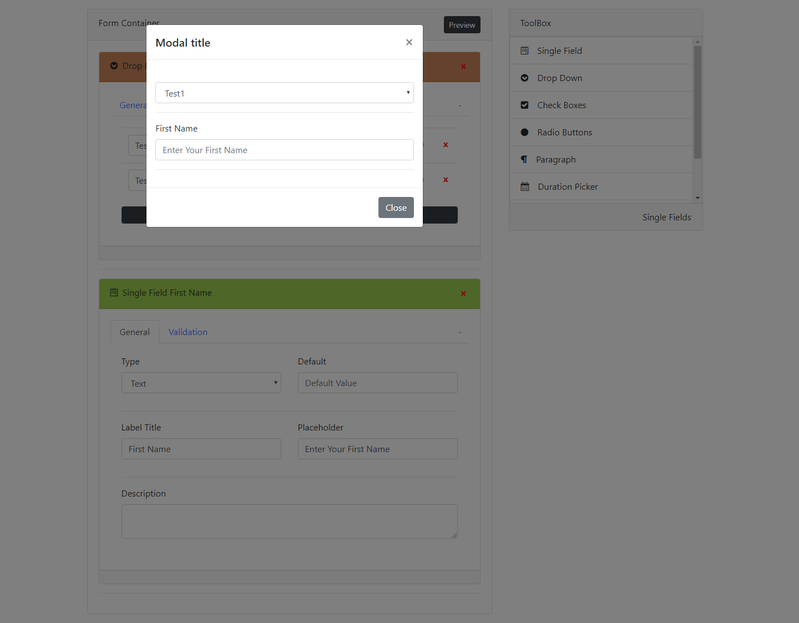

# Zubair React From Builder
Zubair React Form Builder help you to build forms with drag and drop you can also inject your own component.

## Installation
<pre>
  npm i zubair-react-form-builder
  import { FormContainer, ToolBox } from 'zubair-react-form-builder'; 
</pre>

## FormContainer Props
1. custom : Array
2. onSave(form) : Function
3. updateForm(callback) : Function
4. updateOnMount : Boolean
5. debug : Boolean
6. loader: Boolean  // set save button on loading state

// Note OnSave Props also turn on Save Button on &lt;FormContainer /&gt;

## ToolBox Props
1. custom : Array

## Example
You can pass custom components to the form builder

<pre>
const myCustoms = [
    {
        container : &lt ContainerComponent/&gt,
        preview : &lt PreviewComponent/&gt,
        toolbox : {
            title : 'Component',
            icon : 'fa fa-user',
            name : 'CUSTOM_COM'
        },
        states : {
            toolType: 'CUSTOM_COM',
            num1 : 1,
            num2 : 2
        }
    }
]

class App extends React.Component {
    render(){
        /* Simply pass myCustoms to */
        &lt;div className="app"/&gt;
            &lt;div className="row"/&gt;
                &lt;div className="col-8"/&gt;
                    &lt;FormContainer
                        debug={true} // turn on debuging mode
                        updateOnMount={true} // update on mount
                        updateForm={this.updateForm} 
                        onSave={this.save} 
                        custom={ myCustoms } /&gt;
                &lt;/div&gt;
                &lt;div className="col-8"/&gt;
                    &lt ToolBox custom={ myCustoms } /&gt;
                 &lt;/div&gt;
            &lt/div/&gt
        &lt/div/&gt
    }
    
    save(form){
        // you will receive form
        console.log(form);
    }
    
    updateForm(callback){
        // fetch form and set it to callback
        let form = axios.......
        callback(form)
    }
}
</pre>

## Required Props Methods Of Custom Component

1. this.props.changeState(state, this.props.index)

2. this.props.removeField(index)

## Example Props Methods

<pre>
        // on change state
        changeValue(stateFor, value){
            switch (stateFor){
                case "TITLE" :
                    this.setState( { title : value } )
                    break;
                default:
                    return;
            };
            setTimeout(() => {
                return this.props.changeState(this.state, this.props.index);
            }, 0)
        }
        
       
        <input 
            value={this.state.value}
            onChange={(e) => this.changeValue('TITLE', e.target.value)} />
        
         // on remove field   
         this.props.removeField(this.props.index)}>x
            
</pre>